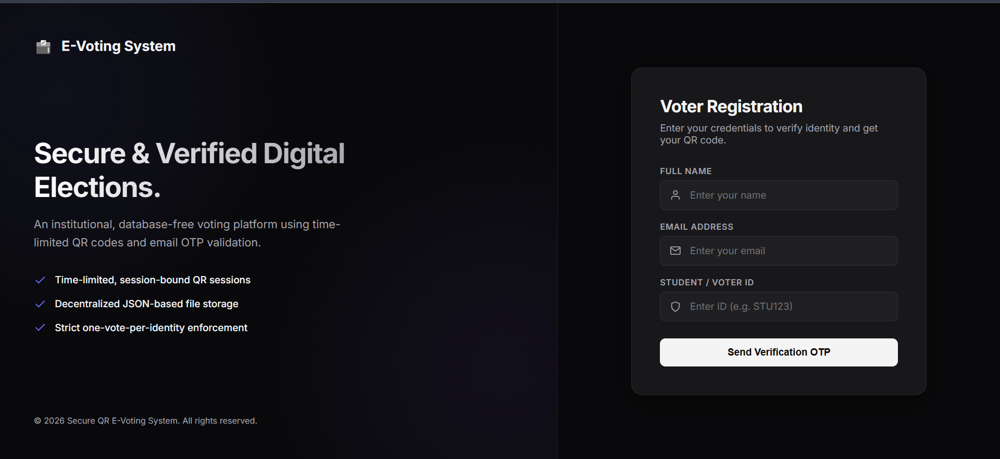
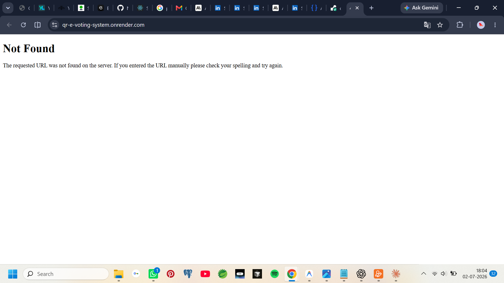
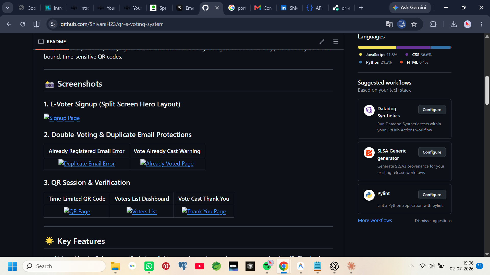
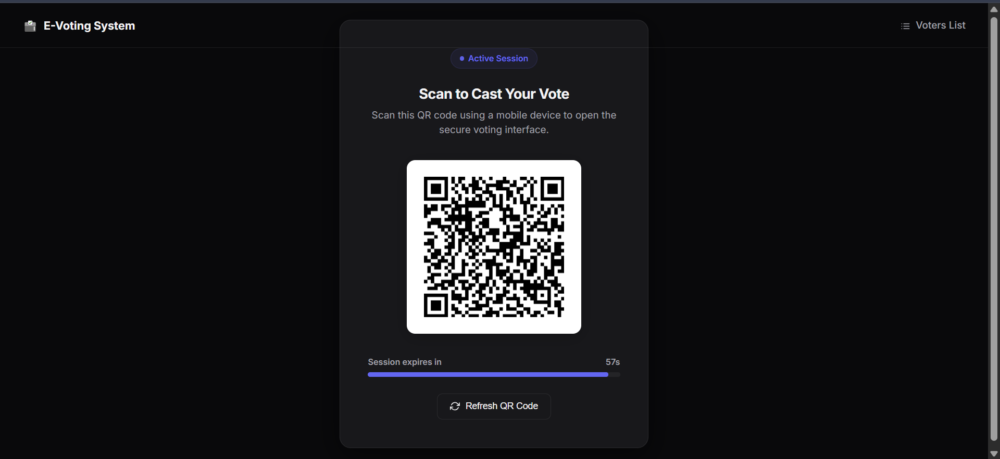
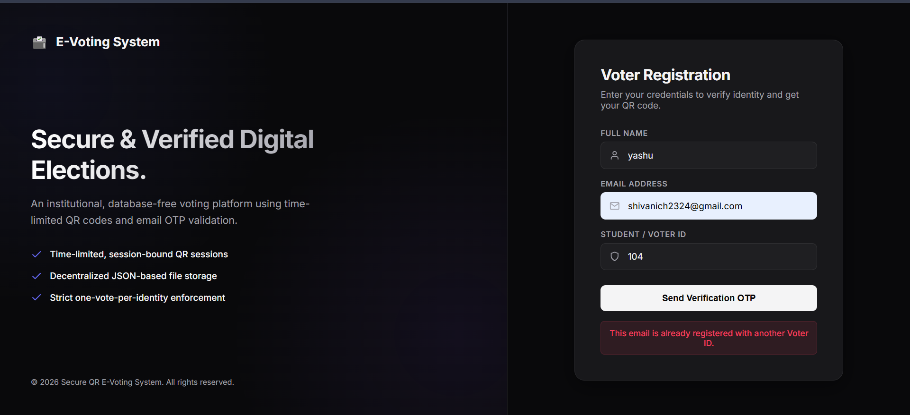
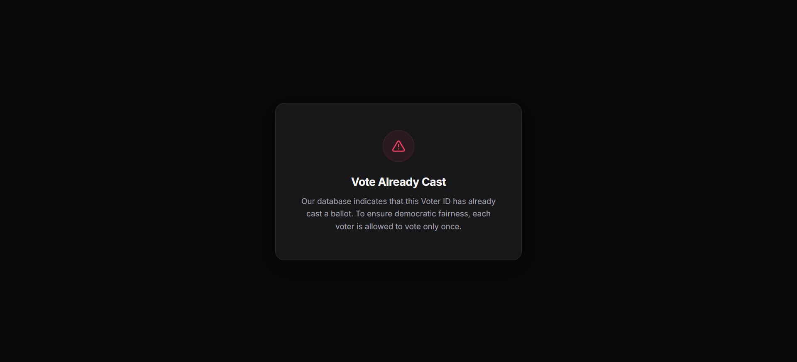

# Secure QR Code-Based E-Voting System

A secure, lightweight, and database-free online voting system designed for small-scale or institutional elections (e.g., colleges, clubs, schools). This application enforces a strict **"one vote per real person"** policy by identifying voters by a unique Student/Voter ID, verifying credentials via email OTP, and granting access to the voting portal through session-bound, time-sensitive QR codes.

---

## 📸 Screenshots

### 1. E-Voter Signup (Split Screen Hero Layout)


### 2. Double-Voting & Duplicate Email Protections
| Already Registered Email Error | Vote Already Cast Warning |
| :---: | :---: |
|  |  |

### 3. QR Session & Verification
| Time-Limited QR Code | Voters List Dashboard | Vote Cast Thank You |
| :---: | :---: | :---: |
|  |  |  |

---

## 🌟 Key Features

- **Unique Identity Enforcement (Redesigned)**: Voters register using a unique government/student ID. The database prevents duplicate registrations or voting under multiple emails for a single physical ID.
- **OTP Email Authentication**: Verifies the identity of every voter by sending a 6-digit One-Time Password to their email address (via SMTP).
- **Time-Sensitive QR Codes**: Generates a dynamic QR code containing a unique session UUID that expires after 60 seconds.
- **Strict Vote Validation**: Prevents double voting by checking state in `voters.json`. If a user attempts to vote again, they are immediately redirected to a warning screen.
- **JSONBin Cloud Synchronization (Deployment Ready)**: Operates on local JSON file storage for local development, and automatically switches to JSONBin.io cloud database synchronization in production when environment variables are supplied.
- **Mobile-Friendly Redirection**: Formulates local network QR URLs allowing users to seamlessly scan the code on a PC monitor and vote securely using their mobile web browsers.
- **Modern Responsive UI**: Clean visual layout, Vercel-style progress bars, and selectable candidate cards with initial avatars and party descriptions.

---

## 📁 Repository Structure

```text
qr-login/
├── backend/
│   ├── app.py               # Flask REST API server, session validation & JSONBin adapter
│   ├── requirements.txt     # Python backend dependencies (gunicorn, requests, etc.)
│   ├── voters.json          # Local database of voter status
│   ├── otp_data.json        # Log of sent and verified OTPs
│   ├── sessions.json        # Active time-limited QR sessions
│   └── .env                 # Environment variables (Gmail credentials)
└── frontend/
    ├── package.json         # React project configuration & scripts
    └── src/
        ├── App.js           # Page routing configuration
        ├── config.js        # Central base URL configuration
        └── Components/      # Modular UI components (SignUp, QRPage, VotingPage, AlreadyVotedPage)
```

---

## 🔌 API Endpoints (Flask Backend)

| Endpoint | Method | Description |
| :--- | :---: | :--- |
| `/send-otp` | `POST` | Generates a 6-digit OTP and sends it to the user's email address. Checks duplicates. |
| `/verify-otp` | `POST` | Verifies the user-entered OTP and registers them in the voter list if new. |
| `/generate_qr` | `POST` | Generates a unique, time-bound (60 seconds) session ID and returns the redirect QR URL. |
| `/validate_session` | `GET` | Validates if the scanned QR session is active, has not expired, and who it belongs to. |
| `/submit_vote` | `POST` | Submits the vote choice and permanently marks the voter's status as `hasVoted: true`. |
| `/get_voters` | `GET` | Retrieves the list of names/emails of users who have successfully voted. |

---

## 🛠️ Installation & Setup

### Prerequisites
- **Python 3.10+**
- **Node.js v16+**

---

### 1. Backend Setup (Flask)
Navigate to the backend folder:
```bash
cd backend
```

Create and activate a virtual environment:
```bash
python -m venv .venv_new
# On Windows (PowerShell):
.\.venv_new\Scripts\Activate.ps1
# On macOS/Linux:
source .venv_new/bin/activate
```

Install backend dependencies:
```bash
pip install -r requirements.txt
```

Create a `.env` file in `backend/` and add your Gmail SMTP credentials:
```env
SENDER_EMAIL=your-email@gmail.com
SENDER_PASSWORD=your-gmail-app-password
```
*(Note: Use a Gmail App Password, not your account's primary login password)*

Run the Flask server:
```bash
python app.py
```
The backend will run on `http://localhost:5000` (and is accessible on your local network interface).

---

### 2. Frontend Setup (React)
Navigate to the frontend folder:
```bash
cd ../frontend
```

Install frontend packages:
```bash
npm install
```

Configure local network IP in `src/config.js` to ensure mobile devices can communicate with the backend:
```javascript
export const BASE_URL = "http://<YOUR_LOCAL_IP>:5000";
```
*(Find your local IP by running `ipconfig` on Windows or `ifconfig` on macOS/Linux).*

Run the React app:
```bash
npm start
```
The site will run on `http://localhost:3000`.

---

## 🚀 Live Cloud Deployment

Please refer to the complete deployment instructions in **[deployment_guide.md](deployment_guide.md)** to configure your persistent database sync and host frontend/backend on Vercel and Render for free.
